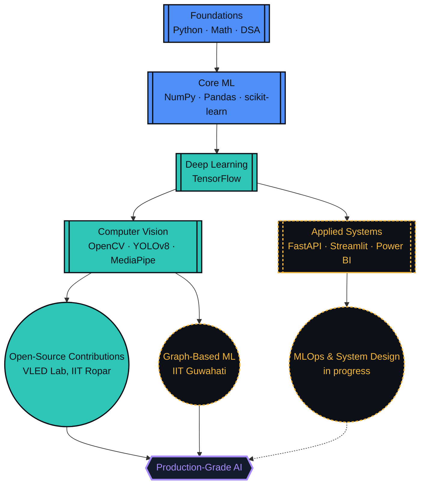
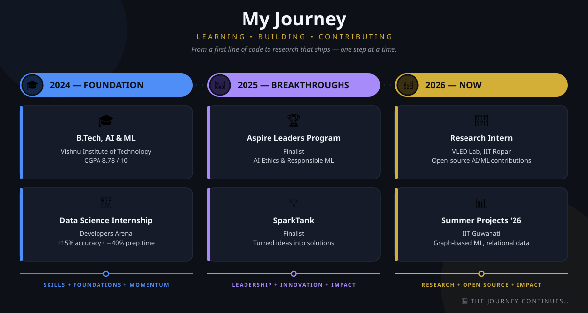

 

━━━━━━━━━━━━━━━━━━━━━━━━━━━━━━━━━━━━━━━━━━━━━━━

 

# Lakshmi Kanth Pulipaka

 

  

 

     

  

 

## About Me

I'm a pre-final-year **B.Tech in AI & ML** student at **Vishnu Institute of Technology** (CGPA `8.78/10`), currently a **Research Intern at the VLED Lab, IIT Ropar**, contributing to open-source AI/ML projects — alongside a graph-based ML project for large-scale relational data at **IIT Guwahati**. I like problems that involve a graph, a deadline, and a model that refuses to converge on the first try.

<table>
<tr>
<td width="50%" valign="top">

🔵 &nbsp;**Building** — deep learning & computer vision systems that ship, not just notebooks that run

🟢 &nbsp;**Learning** — MLOps, system design, scalable model deployment

🟣 &nbsp;**Researching** — graph-based ML for relational data @ IIT Guwahati

🟡 &nbsp;**Open to** — open-source AI/ML & data science collaborations

</td>
<td width="50%" valign="top">

🔵 &nbsp;**Need help with** — scaling ML models for production

🟢 &nbsp;**Ask me about** — Computer Vision, Deep Learning, Graph Analytics, Python for ML

🟣 &nbsp;**Currently** — Pre-final-year B.Tech, AI & ML — CGPA `8.78/10`

🟡 &nbsp;**Fun fact** — I'll happily burn an hour of compute for one extra point of accuracy

</td>
</tr>
</table>

 

## Player Card

| ATTRIBUTE | VALUE |
|:--|:--|
| 🔵 **CLASS** | AI / ML Engineer |
| 🟢 **GUILD** | Vishnu Institute of Technology |
| 🟣 **RANK** | Pre-Final Year (Year 3) |
| 🟡 **POWER LEVEL** | CGPA `8.78 / 10` |
| 🔵 **ACTIVE QUEST** | Summer Research Intern @ VLED Lab, IIT Ropar |
| 🟢 **SPECIAL MOVE** | Squeezing one more % of accuracy out of any model |
| 🟡 **ACHIEVEMENT** | Google BigCode Program — selected for DSA & algorithmic problem-solving |

**Skill XP**

| Skill | Progress | Level |
|:--|:--|:--|
| Python for ML | `████████████████████` 95% | 🟡 Expert |
| Data Analysis / EDA | `████████████████████` 95% | 🟡 Expert |
| Computer Vision | `█████████████████░░░` 85% | 🟢 Advanced |
| Deep Learning | `████████████████░░░░` 80% | 🟢 Advanced |
| DSA & Software Dev | `████████████████░░░░` 80% | 🔵 Proficient |

 

## Skill Tree

*Unlocked skills feed into the next tier — the frontier node is where I'm actively grinding XP right now.*

 

## Tech Arsenal

**Languages**

**ML & Data Science**

**Computer Vision**
 &nbsp;
 &nbsp;

**Backend & Deployment**
 &nbsp;
 &nbsp;

**Data Visualization**
 &nbsp;
 &nbsp;

**Cloud & Dev Tools**

 

## Journey

*How the CGPA, the internships, and the research fellowship actually line up.*

 

## Live Stats

  

**🐍 Contribution Snake**

<picture>
<source media="(prefers-color-scheme: dark)" srcset="https://raw.githubusercontent.com/kanth071/kanth071/output/github-contribution-grid-snake-dark.svg" />
<source media="(prefers-color-scheme: light)" srcset="https://raw.githubusercontent.com/kanth071/kanth071/output/github-contribution-grid-snake.svg" />

</picture>

 

## Featured Projects

<table>
<tr>
<th>Project</th>
<th>Description</th>
<th>Stack</th>
</tr>
<tr>
<td><b>Smoking Detection</b></td>
<td>Computer-vision system that flags smoking activity in real time from camera feeds, built for public-space and campus compliance monitoring.</td>
<td>  </td>
</tr>
<tr>
<td><b>Brain Tumor Detection</b></td>
<td>Deep-learning pipeline that classifies brain MRI scans to flag tumor regions, built to assist radiological screening workflows.</td>
<td>  </td>
</tr>
<tr>
<td><b>Campus Eye</b></td>
<td>Real-time AI surveillance and campus monitoring dashboard for traffic-violation detection using YOLOv8, with automated event logging.</td>
<td>  </td>
</tr>
<tr>
<td><b>Onion Grading</b></td>
<td>Computer-vision quality-grading system that classifies onions by size and surface defects to automate agricultural sorting.</td>
<td>  </td>
</tr>
<tr>
<td><b>Delivery ETA Optimization</b></td>
<td>Graph-analytics logistics platform predicting delivery ETAs and detecting bottleneck hubs — 96%+ accuracy via Gradient Boosting, plus Dijkstra/A* route optimization and SLA breach monitoring.</td>
<td>  </td>
</tr>
<tr>
<td><b>Bed Prediction</b></td>
<td>Hospital bed demand forecasting platform using XGBoost, Random Forest, and Prophet for ICU/ward/emergency forecasting — 90% average accuracy with a live occupancy dashboard.</td>
<td>  </td>
</tr>
</table>

> Pin these repos on your profile for one-click access to source code, and swap the placeholder tech tags above for your exact stack where noted.

 

## Let's Connect

  

Ready to collaborate on data-driven projects, AI/ML solutions, or research ideas? Let's turn raw data into real-world impact.

 

