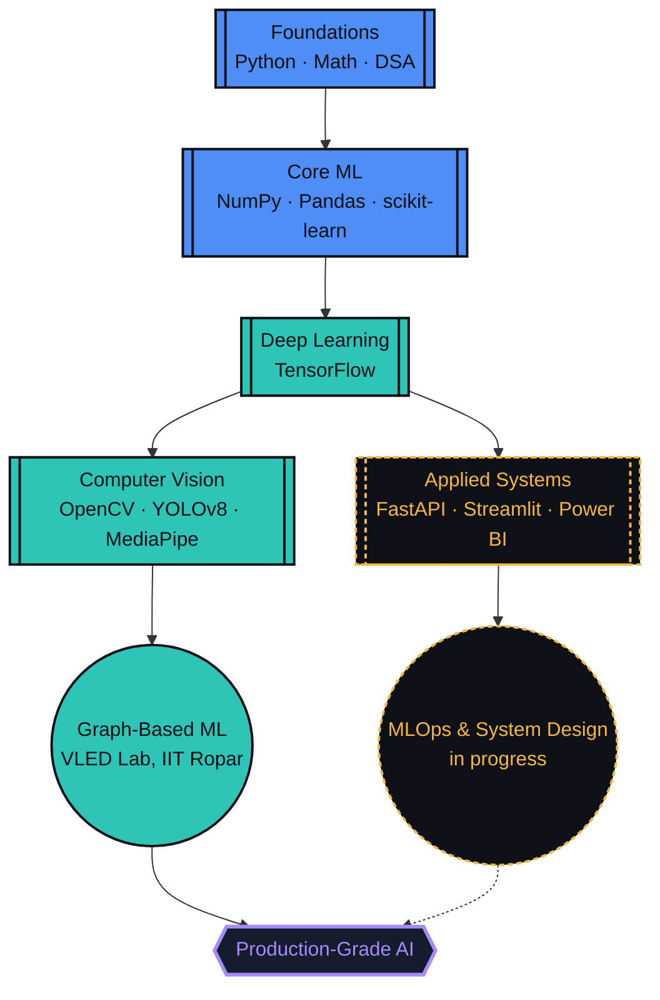
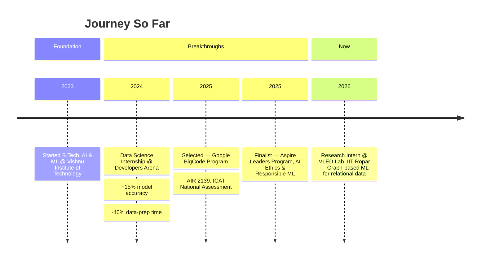

 

# Lakshmi Kanth Pulipaka

   

 

   

  

 

## About Me

I'm a pre-final-year **B.Tech in AI & ML** student at **Vishnu Institute of Technology** (CGPA `8.78/10`), currently a **Research Intern at the VLED Lab, IIT Ropar**, working on graph-based ML for large-scale relational data. I like problems that involve a graph, a deadline, and a model that refuses to converge on the first try.

<table>
<tr>
<td width="50%" valign="top">

 deep learning & computer vision systems that ship, not just notebooks that run

 MLOps, system design, scalable model deployment

 graph-based ML for relational data @ VLED Lab, IIT Ropar

 open-source AI/ML & data science collaborations

</td>
<td width="50%" valign="top">

 scaling ML models for production

 Computer Vision, Deep Learning, Graph Analytics, Python for ML

 Pre-final-year B.Tech, AI & ML — CGPA `8.78/10`

 I'll happily burn an hour of compute for one extra point of accuracy

</td>
</tr>
</table>

 

## Player Card

| ATTRIBUTE | VALUE |
|:--|:--|
|  | AI / ML Engineer |
|  | Vishnu Institute of Technology |
|  | Pre-Final Year (Year 3) |
|  | CGPA `8.78 / 10` |
|  | Summer Research Intern @ VLED Lab, IIT Ropar |
|  | Squeezing one more % of accuracy out of any model |
|  | Google BigCode Program — selected for DSA & algorithmic problem-solving |

**Skill XP**

| Skill | Progress | Level |
|:--|:--|:--|
| Python for ML | `████████████████████` 95% |  |
| Data Analysis / EDA | `████████████████████` 95% |  |
| Computer Vision | `█████████████████░░░` 85% |  |
| Deep Learning | `████████████████░░░░` 80% |  |
| DSA & Software Dev | `████████████████░░░░` 80% |  |

 

## Skill Tree

*Unlocked skills feed into the next tier — the frontier node is where I'm actively grinding XP right now.*

 

## Tech Arsenal

**Languages**

**ML & Data Science**

**Computer Vision**
 &nbsp;
 &nbsp;

**Backend & Deployment**
 &nbsp;
 &nbsp;

**Data Visualization**
 &nbsp;
 &nbsp;

**Cloud & Dev Tools**

 

## Journey

*How the CGPA, the internships, and the research fellowship actually line up.*

 

## Live Stats

  

**Contribution Snake**

> The snake eats your contribution graph and needs one setup step: add the `snake.yml` workflow (delivered alongside this file) to `.github/workflows/` in your `kanth071/kanth071` repo, then enable Actions once under Settings → Actions. GitHub requires this as a separate workflow file — it can't live inside `README.md` itself — but after the first run it updates on its own every day.

 

## Featured Projects

<table>
<tr>
<th>Project</th>
<th>Description</th>
<th>Stack</th>
</tr>
<tr>
<td><b>Smoking Detection</b></td>
<td>Computer-vision system that flags smoking activity in real time from camera feeds, built for public-space and campus compliance monitoring.</td>
<td>  </td>
</tr>
<tr>
<td><b>Brain Tumor Detection</b></td>
<td>Deep-learning pipeline that classifies brain MRI scans to flag tumor regions, built to assist radiological screening workflows.</td>
<td>  </td>
</tr>
<tr>
<td><b>Campus Eye</b></td>
<td>Real-time AI surveillance and campus monitoring dashboard for traffic-violation detection using YOLOv8, with automated event logging.</td>
<td>  </td>
</tr>
<tr>
<td><b>Onion Grading</b></td>
<td>Computer-vision quality-grading system that classifies onions by size and surface defects to automate agricultural sorting.</td>
<td>  </td>
</tr>
<tr>
<td><b>Delivery ETA Optimization</b></td>
<td>Graph-analytics logistics platform predicting delivery ETAs and detecting bottleneck hubs — 96%+ accuracy via Gradient Boosting, plus Dijkstra/A* route optimization and SLA breach monitoring.</td>
<td>  </td>
</tr>
<tr>
<td><b>Bed Prediction</b></td>
<td>Hospital bed demand forecasting platform using XGBoost, Random Forest, and Prophet for ICU/ward/emergency forecasting — 90% average accuracy with a live occupancy dashboard.</td>
<td>  </td>
</tr>
</table>

> Pin these repos on your profile for one-click access to source code, and swap the placeholder tech tags above for your exact stack where noted.

 

## Let's Connect

  

Ready to collaborate on data-driven projects, AI/ML solutions, or research ideas? Let's turn raw data into real-world impact.

 

