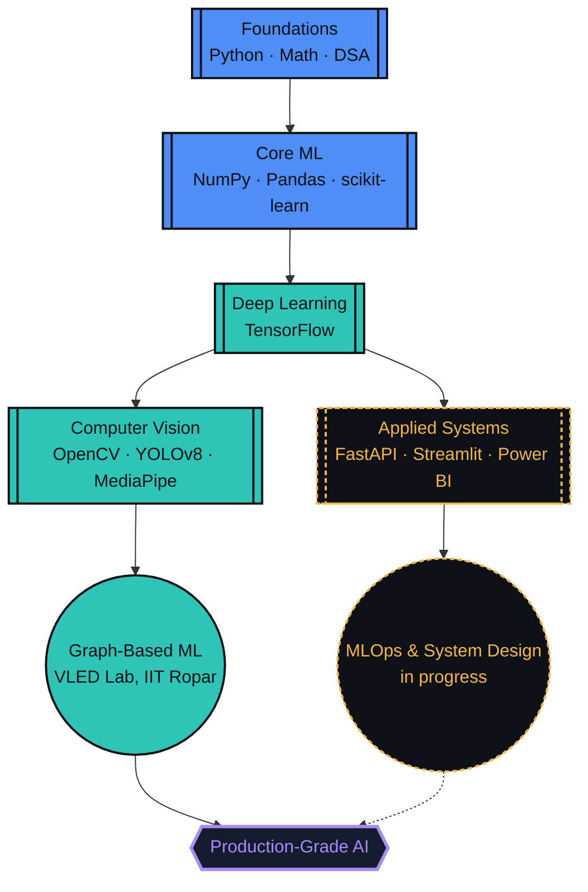

<div align="center">


<br/>

# Lakshmi Kanth Pulipaka

**AI & ML Engineer** &nbsp;·&nbsp; **Computer Vision** &nbsp;·&nbsp; **Graph Analytics** &nbsp;·&nbsp; **Open Source**

**[About](#-about-me) · [Player Card](#-player-card) · [Skill Tree](#-skill-tree) · [Tech Arsenal](#-tech-arsenal) · [Interactive Lab](#-interactive-lab) · [Live Stats](#-live-stats) · [Projects](#-featured-projects) · [Connect](#-lets-connect)**

</div>

<br/>

<a id="-about-me"></a>
## About Me

I'm a pre-final-year **B.Tech in AI & ML** student at **Vishnu Institute of Technology** (CGPA `8.78/10`), currently a **Research Intern at the VLED Lab, IIT Ropar**, working on graph-based ML for large-scale relational data. I like problems that involve a graph, a deadline, and a model that refuses to converge on the first try.

<table>
<tr>
<td width="50%" valign="top">

**Building:** deep learning & computer vision systems that ship, not just notebooks that run
**Learning:** MLOps, system design, scalable model deployment
**Researching:** graph-based ML for relational data @ VLED Lab, IIT Ropar
**Open to:** open-source AI/ML & data science collaborations

</td>
<td width="50%" valign="top">

**Need help with:** scaling ML models for production
**Ask me about:** Computer Vision, Deep Learning, Graph Analytics, Python for ML
**Currently:** Pre-final-year B.Tech, AI & ML — CGPA `8.78/10`
**Fun fact:** I'll happily burn an hour of compute for one extra point of accuracy

</td>
</tr>
</table>

<br/>

<a id="-player-card"></a>
## Player Card

<div align="center">

| ATTRIBUTE | VALUE |
|:--|:--|
| **CLASS** | AI / ML Engineer |
| **GUILD** | Vishnu Institute of Technology |
| **RANK** | Pre-Final Year (Year 3) |
| **POWER LEVEL (CGPA)** | `8.78 / 10` |
| **ACTIVE QUEST** | Summer Research Intern @ VLED Lab, IIT Ropar |
| **SPECIAL MOVE** | Squeezing one more % of accuracy out of any model |
| **HIGHEST ACHIEVEMENT** | Google BigCode Program — selected for DSA & algorithmic problem-solving |

</div>

**Skill XP**

| Skill | Progress | Experience |
|:--|:--|:--|
| Python for ML | `████████████████████` 95% | 2+ years |
| Data Analysis / EDA | `████████████████████` 95% | 2+ years |
| Computer Vision | `█████████████████░░░` 85% | 1+ years |
| Deep Learning | `████████████████░░░░` 80% | 1+ years |
| DSA & Software Dev | `████████████████░░░░` 80% | 1+ years |

<br/>

<a id="-skill-tree"></a>
## Skill Tree

*Unlocked skills feed into the next tier — the frontier node is where I'm actively grinding XP right now.*



<br/>

<a id="-tech-arsenal"></a>
## Tech Arsenal

<div align="center">

**Languages**


**ML & Data Science**


**Computer Vision**
 &nbsp;
 &nbsp;


**Backend & Deployment**
 &nbsp;
 &nbsp;


**Data Visualization**
 &nbsp;
 &nbsp;


**Cloud & Dev Tools**


</div>

<br/>

<a id="-interactive-lab"></a>
## Interactive Lab

*Three quick, click-to-expand challenges — a project knowledge check, a code-review game, and a branching what-happens-next story.*

### Knowledge Check

<details>
<summary><b>Challenge 1 — Delivery ETA Optimization</b></summary>
<br/>

> A graph-analytics platform predicts delivery ETAs and flags bottleneck hubs at **96%+ accuracy**, using Gradient Boosting plus Dijkstra/A* for route optimization and SLA breach monitoring.
>
> **Riddle:** *I have no legs but I find the shortest way. I weigh every edge before I choose my say. What algorithm am I?*

<details>
<summary>Reveal answer</summary>

Dijkstra's algorithm (with A* as the informed variant) — exactly what powers the route optimization layer of this project.

</details>
</details>

<details>
<summary><b>Challenge 2 — Bed Prediction</b></summary>
<br/>

> A hospital bed demand forecasting platform combining **XGBoost, Random Forest, and Prophet** for ICU/ward/emergency forecasting, hitting **90% average accuracy** with a live occupancy dashboard.
>
> **Riddle:** *I don't predict the weather, but I was built for time. Meta gave me my name — what forecasting library am I?*

<details>
<summary>Reveal answer</summary>

Prophet — Meta's time-series forecasting library, used here to project bed demand.

</details>
</details>

<details>
<summary><b>Challenge 3 — Campus Eye</b></summary>
<br/>

> A real-time AI surveillance and campus monitoring dashboard using **YOLOv8** for traffic violation detection, with automated event logging.
>
> **Riddle:** *I see the whole frame in one glance, no sliding window, no second chance. What object-detection family am I?*

<details>
<summary>Reveal answer</summary>

YOLO (You Only Look Once) — YOLOv8 specifically powers real-time detection in this dashboard.

</details>
</details>

### Debug This

<details>
<summary><b>Click to open the file</b> — <code>validate.py</code></summary>
<br/>

```python
def validate(model, val_loader):
    total_correct = 0
    for images, labels in val_loader:
        outputs = model(images)
        preds = outputs.argmax(dim=1)
        total_correct += (preds == labels).sum().item()
    return total_correct / len(val_loader.dataset)
```

One line is missing, and it's quietly inflating every validation score in this file. Spot it before checking the fix.

<details>
<summary>Reveal the bug</summary>

No `model.eval()` (and no `torch.no_grad()`) before the loop. Without `eval()`, Dropout and BatchNorm layers stay in training mode, so validation numbers don't reflect real inference behavior — and without `no_grad()`, you're wasting memory computing gradients you'll never use.

```python
def validate(model, val_loader):
    model.eval()
    total_correct = 0
    with torch.no_grad():
        for images, labels in val_loader:
            outputs = model(images)
            preds = outputs.argmax(dim=1)
            total_correct += (preds == labels).sum().item()
    return total_correct / len(val_loader.dataset)
```

</details>
</details>

### Simulation — A Day in the Life of a Model

<details>
<summary>▶ <b>Press Start</b></summary>
<br/>

You open your laptop. Training run #47 finished overnight.

<details>
<summary>Check the validation accuracy</summary>
<br/>

96.2%. Better than yesterday. But something looks too clean in the confusion matrix.

<details>
<summary>Investigate the confusion matrix</summary>
<br/>

Found it — a data leak between the train and validation splits. Classic.

<details>
<summary>Fix the split and retrain</summary>
<br/>

**Achievement Unlocked — "Trust, But Verify"**
Real accuracy: 91.4%. Lower number, higher confidence. Ship it.

</details>
</details>
</details>

<details>
<summary>Skip validation and ship it anyway</summary>
<br/>

**Achievement Unlocked — "Production Incident #1"**
Narrator: this is exactly why we check the confusion matrix.

</details>
</details>

**Achievements Unlocked**

<div align="center">


</div>

<br/>

<a id="-live-stats"></a>
## Live Stats

<div align="center">


<br/><br/>


**Contribution Snake**


name: Generate Snake Animation

on:
  schedule:
    - cron: "0 0 * * *"   # runs once a day
  workflow_dispatch: {}   # lets you trigger it manually from the Actions tab
  push:
    branches:
      - main

jobs:
  generate:
    permissions:
      contents: write
    runs-on: ubuntu-latest
    steps:
      - name: Generate a snake game from a GitHub contribution graph
        uses: Platane/snk@v3
        id: snake-gif
        with:
          github_user_name: ${{ github.repository_owner }}
          outputs: |
            dist/github-contribution-grid-snake.svg
            dist/github-contribution-grid-snake-dark.svg?palette=github-dark

      - name: Push the generated files to the "output" branch
        uses: crazy-max/ghaction-github-pages@v4
        with:
          target_branch: output
          build_dir: dist
        env:
          GITHUB_TOKEN: ${{ secrets.GITHUB_TOKEN }}

</div>

> The snake eats your contribution graph and needs one setup step: add the `snake.yml` workflow (delivered alongside this file) to `.github/workflows/` in your `kanth071/kanth071` repo, then enable Actions once under Settings → Actions. GitHub requires this as a separate workflow file — it can't live inside `README.md` itself — but after the first run it updates on its own every day.

<br/>

<a id="-featured-projects"></a>
## Featured Projects

<table>
<tr>
<th>Project</th>
<th>Description</th>
<th>Stack</th>
</tr>
<tr>
<td><b>Smoking Detection</b></td>
<td>Computer-vision system that flags smoking activity in real time from camera feeds, built for public-space and campus compliance monitoring.</td>
<td><br/><br/></td>
</tr>
<tr>
<td><b>Brain Tumor Detection</b></td>
<td>Deep-learning pipeline that classifies brain MRI scans to flag tumor regions, built to assist radiological screening workflows.</td>
<td><br/><br/></td>
</tr>
<tr>
<td><b>Campus Eye</b></td>
<td>Real-time AI surveillance and campus monitoring dashboard for traffic-violation detection using YOLOv8, with automated event logging.</td>
<td><br/><br/></td>
</tr>
<tr>
<td><b>Onion Grading</b></td>
<td>Computer-vision quality-grading system that classifies onions by size and surface defects to automate agricultural sorting.</td>
<td><br/><br/></td>
</tr>
<tr>
<td><b>Delivery ETA Optimization</b></td>
<td>Graph-analytics logistics platform predicting delivery ETAs and detecting bottleneck hubs — 96%+ accuracy via Gradient Boosting, plus Dijkstra/A* route optimization and SLA breach monitoring.</td>
<td><br/><br/></td>
</tr>
<tr>
<td><b>Bed Prediction</b></td>
<td>Hospital bed demand forecasting platform using XGBoost, Random Forest, and Prophet for ICU/ward/emergency forecasting — 90% average accuracy with a live occupancy dashboard.</td>
<td><br/><br/></td>
</tr>
</table>

> Pin these repos on your profile for one-click access to source code, and swap the placeholder tech tags above for your exact stack where noted.

<br/>

<a id="-lets-connect"></a>
## Let's Connect

<div align="center">

<a href="https://www.linkedin.com/in/lakshmi-kanth-pulipaka-6957b932b"></a>
<a href="https://github.com/kanth071"></a>

<br/><br/>

Ready to collaborate on data-driven projects, AI/ML solutions, or research ideas? Let's turn raw data into real-world impact.

</div>

<br/>

<a id="-what-keeps-me-building"></a>
<div align="center">


</div>
