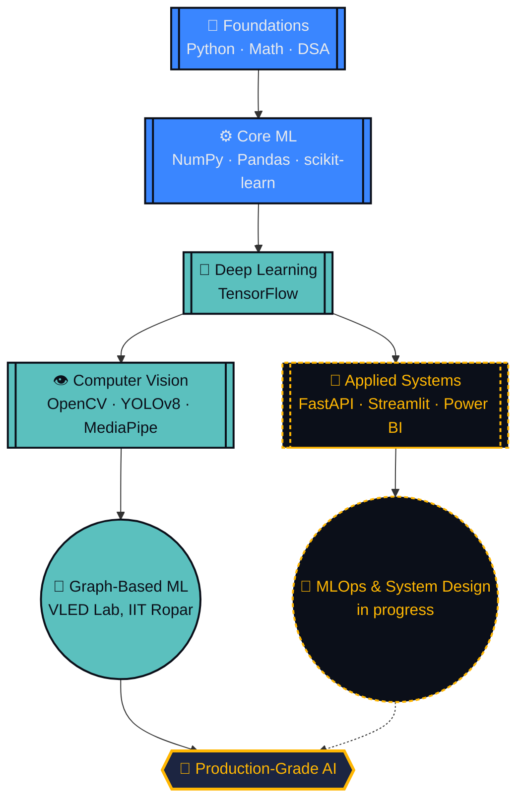

<div align="center">

# LAKSHMI KANTH PULIPAKA

**AI & ML Engineer** · Building Systems That Think

<a href="https://git.io/typing-svg">
  
</a>

*Quietly building. Loudly shipping.*

<br/>


<br/><br/>

<a href="#-about-me"></a>
<a href="#-player-card"></a>
<a href="#-skill-tree"></a>
<a href="#-tech-arsenal"></a>
<a href="#-interactive-lab"></a>
<a href="#-live-stats"></a>
<a href="#-featured-projects"></a>
<a href="#-lets-connect"></a>
<a href="#-what-keeps-me-building"></a>

</div>

<br/>

<a id="-about-me"></a>
## 🧭 About Me

I'm a pre-final-year **B.Tech in AI & ML** student at **Vishnu Institute of Technology** (CGPA `8.78/10`), currently spending my summer as a **Research Intern at the VLED Lab, IIT Ropar**, working on graph-based ML for large-scale relational data. I like problems that involve a graph, a deadline, and a model that refuses to converge on the first try.

<table>
<tr>
<td width="50%" valign="top">

**🔭 Building:** deep learning & computer vision systems that ship, not just notebooks that run
**🌱 Learning:** MLOps, system design, scalable model deployment
**🔬 Researching:** graph-based ML for relational data @ VLED Lab, IIT Ropar
**👯 Open to:** open-source AI/ML & data science collaborations

</td>
<td width="50%" valign="top">

**🤔 Need help with:** scaling ML models for production
**💬 Ask me about:** Computer Vision, Deep Learning, Graph Analytics, Python for ML
**🎓 Currently:** Pre-final-year B.Tech, AI & ML — CGPA `8.78/10`
**⚡ Fun fact:** I'll happily burn an hour of compute for one extra point of accuracy

</td>
</tr>
</table>

<br/>

<a id="-player-card"></a>
## 🪪 Player Card

<div align="center">

| ATTRIBUTE | VALUE |
|:--|:--|
| 🧑‍💻 **CLASS** | AI / ML Engineer |
| 🏛️ **GUILD** | Vishnu Institute of Technology |
| 📈 **RANK** | Pre-Final Year (Year 3) |
| 💠 **POWER LEVEL (CGPA)** | `8.78 / 10` |
| 🧪 **ACTIVE QUEST** | Summer Research Intern @ VLED Lab, IIT Ropar |
| 🏹 **SPECIAL MOVE** | Squeezing one more % of accuracy out of any model |
| 🏆 **HIGHEST ACHIEVEMENT** | Google BigCode Program — selected for DSA & algorithmic problem-solving |

</div>

**Skill XP Bars**

| Skill | Progress | Experience |
|:--|:--|:--|
| Python for ML |  | 2+ years |
| Data Analysis / EDA |  | 2+ years |
| Computer Vision |  | 1+ years |
| Deep Learning |  | 1+ years |
| DSA & Software Dev |  | 1+ years |

<br/>

<a id="-skill-tree"></a>
## 🌳 Skill Tree

*Unlocked skills feed into the next tier — the frontier node is where I'm actively grinding XP right now.*



<br/>

<a id="-tech-arsenal"></a>
## 🧰 Tech Arsenal

<div align="center">

**Languages**


**ML & Data Science**


**Computer Vision**
 &nbsp;
 &nbsp;


**Backend & Deployment**
 &nbsp;
 &nbsp;


**Data Visualization**
 &nbsp;
 &nbsp;


**Cloud & Dev Tools**


</div>

<br/>

<a id="-interactive-lab"></a>
## 🧠 Interactive Lab

*Three quick, click-to-expand challenges — a project knowledge check, a code-review game, and a branching what-happens-next story. No downloads, just curiosity.*

### 🎯 Knowledge Check

<details>
<summary><b>Challenge 1 — Delivery ETA Optimization</b></summary>
<br/>

> A graph-analytics platform predicts delivery ETAs and flags bottleneck hubs at **96%+ accuracy**, using Gradient Boosting plus Dijkstra/A* for route optimization and SLA breach monitoring.
>
> **Riddle:** *I have no legs but I find the shortest way. I weigh every edge before I choose my say. What algorithm am I?*

<details>
<summary>🗝️ Reveal answer</summary>

Dijkstra's algorithm (with A* as the informed variant) — exactly what powers the route optimization layer of this project.

</details>
</details>

<details>
<summary><b>Challenge 2 — BedForecast</b></summary>
<br/>

> A hospital bed demand forecasting platform combining **XGBoost, Random Forest, and Prophet** for ICU/ward/emergency forecasting, hitting **90% average accuracy** with a live occupancy dashboard.
>
> **Riddle:** *I don't predict the weather, but I was built for time. Meta gave me my name — what forecasting library am I?*

<details>
<summary>🗝️ Reveal answer</summary>

Prophet — Meta's time-series forecasting library, used here to project bed demand.

</details>
</details>

<details>
<summary><b>Challenge 3 — Campus AI Dashboard</b></summary>
<br/>

> A real-time AI surveillance and campus monitoring dashboard using **YOLOv8** for traffic violation detection, with automated event logging.
>
> **Riddle:** *I see the whole frame in one glance, no sliding window, no second chance. What object-detection family am I?*

<details>
<summary>🗝️ Reveal answer</summary>

YOLO (You Only Look Once) — YOLOv8 specifically powers real-time detection in this dashboard.

</details>
</details>

### 🧩 Debug This

<details>
<summary><b>Click to open the file</b> — <code>validate.py</code></summary>
<br/>

```python
def validate(model, val_loader):
    total_correct = 0
    for images, labels in val_loader:
        outputs = model(images)
        preds = outputs.argmax(dim=1)
        total_correct += (preds == labels).sum().item()
    return total_correct / len(val_loader.dataset)
```

One line is missing, and it's quietly inflating every validation score in this file. Spot it before checking the fix.

<details>
<summary>🗝️ Reveal the bug</summary>

No `model.eval()` (and no `torch.no_grad()`) before the loop. Without `eval()`, Dropout and BatchNorm layers stay in training mode, so validation numbers don't reflect real inference behavior — and without `no_grad()`, you're wasting memory computing gradients you'll never use.

```python
def validate(model, val_loader):
    model.eval()
    total_correct = 0
    with torch.no_grad():
        for images, labels in val_loader:
            outputs = model(images)
            preds = outputs.argmax(dim=1)
            total_correct += (preds == labels).sum().item()
    return total_correct / len(val_loader.dataset)
```

</details>
</details>

### 🕹️ Simulation — A Day in the Life of a Model

<details>
<summary>▶️ <b>Press Start</b></summary>
<br/>

You open your laptop. Training run #47 finished overnight.

<details>
<summary>🔍 Check the validation accuracy</summary>
<br/>

96.2%. Better than yesterday. But something looks too clean in the confusion matrix.

<details>
<summary>🐛 Investigate the confusion matrix</summary>
<br/>

Found it — a data leak between the train and validation splits. Classic.

<details>
<summary>🛠️ Fix the split and retrain</summary>
<br/>

**🏆 Achievement Unlocked — "Trust, But Verify"**
Real accuracy: 91.4%. Lower number, higher confidence. Ship it.

</details>
</details>
</details>

<details>
<summary>☕ Skip validation and ship it anyway</summary>
<br/>

**💀 Achievement Unlocked — "Production Incident #1"**
Narrator: this is exactly why we check the confusion matrix.

</details>
</details>

**🏁 Achievements Unlocked**

<div align="center">


</div>

<br/>

<a id="-live-stats"></a>
## 📊 Live Stats

<div align="center">


</div>

<br/>

<a id="-featured-projects"></a>
## 🗂️ Featured Projects

<table>
<tr>
<th>Project</th>
<th>Description</th>
<th>Stack</th>
</tr>
<tr>
<td>🚚 <b>Delivery ETA Optimization</b></td>
<td>Graph-analytics logistics platform predicting delivery ETAs and detecting bottleneck hubs — 96%+ accuracy via Gradient Boosting, plus Dijkstra/A* route optimization and SLA breach monitoring.</td>
<td><br/><br/></td>
</tr>
<tr>
<td>🏥 <b>BedForecast</b></td>
<td>Hospital bed demand forecasting platform using XGBoost, Random Forest, and Prophet for ICU/ward/emergency forecasting — 90% average accuracy with a live occupancy dashboard.</td>
<td><br/><br/></td>
</tr>
<tr>
<td>🎥 <b>Campus AI Dashboard</b></td>
<td>Real-time AI surveillance and campus monitoring dashboard for traffic violation detection using YOLOv8, with automated event logging.</td>
<td><br/><br/></td>
</tr>
<tr>
<td>🌩️ <b>Fake Weather Alert Detection</b></td>
<td>ML system to detect and flag fake or manipulated weather alerts before they spread.</td>
<td><br/></td>
</tr>
<tr>
<td>📊 <b>Power BI Dashboards</b></td>
<td>Data visualization and business-intelligence dashboards for analytics reporting.</td>
<td></td>
</tr>
</table>

> 📌 Pin your best repos on your profile for one-click access to source code — replace the placeholder links above with your actual repo URLs.

<br/>

<a id="-lets-connect"></a>
## 🌐 Let's Connect

<div align="center">

<a href="https://linkedin.com/in/YOUR-LINKEDIN-HANDLE"></a>
<a href="mailto:YOUR-EMAIL@example.com"></a>
<a href="https://github.com/YOUR-GITHUB-USERNAME"></a>
<a href="https://YOUR-PORTFOLIO-LINK.com"></a>

<br/><br/>

⚡ Ready to collaborate on data-driven projects, AI/ML solutions, or research ideas?
💡 Let's turn raw data into real-world impact.

</div>

<br/>

<a id="-what-keeps-me-building"></a>
## ⚡ What Keeps Me Building

<div align="center">


<br/>

**Thanks for scrolling all the way down. Now go build something.**

</div>
